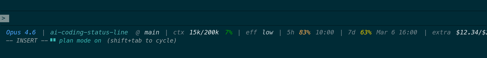
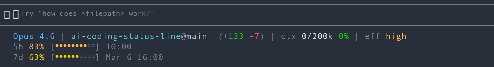
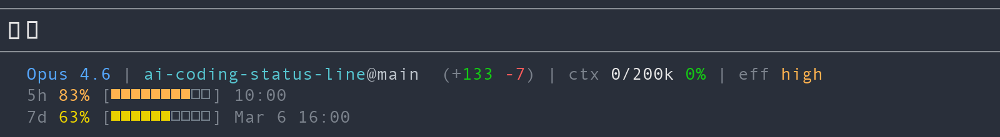

<p align="center">
  
</p>

<h1 align="center">AICodingStatusLine</h1>

<p align="center">
  <strong>Claude Code 自定义状态栏</strong> — 在终端底部实时显示模型信息、Git 上下文、Token 用量与速率限制
</p>

<p align="center">
  <a href="#-快速安装">安装</a>&nbsp;&nbsp;·&nbsp;&nbsp;
  <a href="#-布局与样式">布局</a>&nbsp;&nbsp;·&nbsp;&nbsp;
  <a href="#-主题">主题</a>&nbsp;&nbsp;·&nbsp;&nbsp;
  <a href="#%EF%B8%8F-完整配置参考">配置</a>&nbsp;&nbsp;·&nbsp;&nbsp;
  <a href="#-常见问题">FAQ</a>
</p>

---

## Fork 说明

本仓库 fork 自 [daniel3303/ClaudeCodeStatusLine](https://github.com/daniel3303/ClaudeCodeStatusLine)（原作者 Daniel Oliveira），在保留原始状态栏概念和跨平台脚本的基础上增加了以下特性：

- 自适应宽度裁剪
- 9 种主题配色预设（含冷色系与暖色系）
- 多行 `bars` 布局 + 可选进度条字符（`ascii` / `dots` / `squares`）
- 自定义 7 天重置时间格式
- 过期 reset 时间自动隐藏
- PowerShell 安全的 Unicode 渲染

---

## 状态栏段落说明

| 段落 | 含义 | 示例 |
|------|------|------|
| **Model** | 当前模型名称 | `Opus 4.6` |
| **CWD@Branch** | 当前目录名 + Git 分支，仓库有改动时追加 `(+N -N)` | `myapp@main (+3 -1)` |
| **ctx** | 已用 / 总计 Context Window Token 数 + 百分比 | `ctx 15k/200k 7%` |
| **eff** | 推理努力等级 | `low` / `med` / `high` |
| **5h** | 5 小时速率限制用量百分比 + 重置时间 | `5h 83% 2:00` |
| **7d** | 7 天速率限制用量百分比 + 重置时间 | `7d 63% 03 06 08:00` |
| **extra** | 额外用量积分（启用时才显示） | `extra $12.34/$20.00` |

用量百分比按阈值变色：🟢 <50% → 🟡 ≥50% → 🟠 ≥70% → 🔴 ≥90%

> 如果 reset 时间已过期（早于当前时间），状态栏会自动隐藏该时间，只显示百分比。

---

## 🚀 快速安装

### 方式一：让 Claude 帮你装（推荐）

复制 `statusline.sh`（Windows 用 `statusline.ps1`）的全部内容，粘贴到 Claude Code 对话中并发送：

> Use this script as my status bar

Claude Code 会自动保存脚本并配置 `settings.json`，无需手动操作。

---

### 方式二：手动安装

#### macOS / Linux

**前置依赖：**

| 工具 | 用途 |
|------|------|
| `jq` | 解析 JSON |
| `curl` | 从 Anthropic API 获取用量数据 |
| Claude Code | 需 OAuth 认证（Pro/Max 订阅） |

**步骤：**

```bash
# 1. 复制脚本到 Claude 配置目录
cp statusline.sh ~/.claude/statusline.sh
chmod +x ~/.claude/statusline.sh

# 2. 配置 settings.json（如文件已存在，手动合并即可）
cat <<'EOF' >> ~/.claude/settings.json
{
  "statusLine": {
    "type": "command",
    "command": "~/.claude/statusline.sh"
  }
}
EOF

# 3. 重启 Claude Code
```

#### Windows

> Windows 用户请使用 `statusline.ps1`，不要使用 bash 脚本。

**前置依赖：**

| 工具 | 用途 |
|------|------|
| PowerShell 5.1+ | Windows 10/11 自带 |
| `git` | 需在 PATH 中，用于分支/差异信息 |
| Claude Code | 需 OAuth 认证（Pro/Max 订阅） |

**步骤：**

```powershell
# 1. 复制脚本
Copy-Item statusline.ps1 "$env:USERPROFILE\.claude\statusline.ps1"
```

在 `%USERPROFILE%\.claude\settings.json` 中添加：

**PowerShell / CMD 环境：**

```json
{
  "statusLine": {
    "type": "command",
    "command": "powershell -NoProfile -File \"%USERPROFILE%\\.claude\\statusline.ps1\""
  }
}
```

**Git Bash / WSL 环境：**

```json
{
  "statusLine": {
    "type": "command",
    "command": "powershell -NoProfile -File \"$USERPROFILE\\.claude\\statusline.ps1\""
  }
}
```

> **注意：** CMD/PowerShell 中使用 `%USERPROFILE%`，bash 中使用 `$USERPROFILE`。两种语法不可混用。

重启 Claude Code 即可生效。

---

## 🎨 布局与样式

### 布局模式

通过 `CLAUDE_CODE_STATUSLINE_LAYOUT` 切换：

| 值 | 说明 |
|----|------|
| `compact` | **默认**。所有信息压缩在一行 |
| `bars` | 概览信息在第一行，5h / 7d 各自渲染为带进度条的独立行 |

### 进度条字符（仅 `bars` 布局生效）

通过 `CLAUDE_CODE_STATUSLINE_BAR_STYLE` 切换：

| 值 | 填充 / 空白 | 效果 |
|----|-------------|------|
| `ascii` | `=` / `-` | **默认**，最大兼容性 |
| `dots` | `●` / `○` | 圆点风格 |
| `squares` | `■` / `□` | 方块风格 |

未知值自动回退到 `ascii`。

### 截图对比

**`dots` 风格：**



**`squares` 风格：**



---

## 🖌 主题

通过 `CLAUDE_CODE_STATUSLINE_THEME` 切换 ANSI 配色方案：

| 值 | 风格 | 色温 | 灵感来源 |
|----|------|------|----------|
| `default` | **默认**。蓝色主调，高对比度 | 冷色 | — |
| `forest` | 绿色主调，柔和自然 | 冷色 | — |
| `dracula` | 紫色主调，暗色背景下表现出色 | 冷色 | [Dracula Theme](https://draculatheme.com) |
| `monokai` | 青色主调，经典代码编辑器风格 | 冷色 | [Monokai Pro](https://monokai.pro) |
| `solarized` | 蓝色主调，低对比度护眼 | 冷色 | [Solarized](https://ethanschoonover.com/solarized) |
| `ocean` | 青蓝主调，清爽海洋风 | 冷色 | Material Design |
| `sunset` | 珊瑚橙主调，温暖日落氛围 | **暖色** | Material Design |
| `amber` | 琥珀金主调，沉稳大地色 | **暖色** | — |
| `rose` | 玫瑰粉主调，柔和优雅 | **暖色** | — |

未知值自动回退到 `default`。

### 配色对照

**冷色系主题：**

| 色彩角色 | `default` | `forest` | `dracula` | `monokai` | `solarized` | `ocean` |
|----------|-----------|----------|-----------|-----------|-------------|---------|
| 主强调色 | 🔵 `#4DA6FF` | 🟢 `#78C478` | 🟣 `#BD93F9` | 🔵 `#66D9EF` | 🔵 `#268BD2` | 🔵 `#00BCD4` |
| 目录/Teal | `#4DAFB0` | `#5EAA96` | `#8BE9FD` | `#A6E22E` | `#2AA198` | `#0097A7` |
| 分支名 | `#C4D0D4` | `#D6E0CD` | `#F8F8F2` | `#E6DB74` | `#93A1A1` | `#B2EBF2` |
| 弱化文字 | `#73848B` | `#84907C` | `#6272A4` | `#75715E` | `#586E75` | `#78909C` |

**暖色系主题：**

| 色彩角色 | `sunset` | `amber` | `rose` |
|----------|----------|---------|--------|
| 主强调色 | 🟠 `#FF8A65` | 🟡 `#FFC107` | 🩷 `#F48FB1` |
| 目录/Teal | `#FFB74D` | `#DCB86A` | `#CE93D8` |
| 分支名 | `#FFCC80` | `#F0E6C8` | `#F8D7E0` |
| 弱化文字 | `#A1887F` | `#9E9477` | `#AD8B9F` |

---

## ⚙️ 完整配置参考

所有配置通过环境变量控制，可在终端临时设置，也可写入 `settings.json` 持久化。

| 环境变量 | 默认值 | 说明 |
|----------|--------|------|
| `CLAUDE_CODE_STATUSLINE_LAYOUT` | `compact` | 布局模式：`compact` 或 `bars` |
| `CLAUDE_CODE_STATUSLINE_BAR_STYLE` | `ascii` | 进度条字符：`ascii`、`dots`、`squares` |
| `CLAUDE_CODE_STATUSLINE_THEME` | `default` | 配色主题：`default`、`forest`、`dracula`、`monokai`、`solarized`、`ocean`、`sunset`、`amber`、`rose` |
| `CLAUDE_CODE_STATUSLINE_MAX_WIDTH` | 终端宽度 | 强制指定宽度预算（正整数） |
| `CLAUDE_CODE_STATUSLINE_SEVEN_DAY_TIME_FORMAT` | `%m %d %H:%M` | 自定义 7d 重置时间格式 |

### 7d 时间格式支持的 strftime 标记

| 标记 | 含义 | 示例 |
|------|------|------|
| `%y` | 两位年份 | `26` |
| `%Y` | 四位年份 | `2026` |
| `%m` | 月（补零） | `03` |
| `%d` | 日（补零） | `06` |
| `%H` | 时（24h，补零） | `08` |
| `%M` | 分（补零） | `00` |
| `%b` | 缩写月名 | `Mar` |
| `%B` | 完整月名 | `March` |

无效格式自动回退到 `%m %d %H:%M`。

### 持久化配置示例

在 `~/.claude/settings.json` 的 `env` 字段中添加：

```json
{
  "statusLine": {
    "type": "command",
    "command": "~/.claude/statusline.sh"
  },
  "env": {
    "CLAUDE_CODE_STATUSLINE_LAYOUT": "bars",
    "CLAUDE_CODE_STATUSLINE_BAR_STYLE": "dots",
    "CLAUDE_CODE_STATUSLINE_THEME": "forest",
    "CLAUDE_CODE_STATUSLINE_SEVEN_DAY_TIME_FORMAT": "%b %d %H:%M"
  }
}
```

---

## 📐 宽度自适应

状态栏会根据终端宽度自动裁剪，按以下优先级逐步缩减：

| 优先级 | 操作 |
|--------|------|
| 1 | 移除 `extra` 段落 |
| 2 | 隐藏 7d 重置时间 |
| 3 | 隐藏 5h 重置时间 |
| 4 | 隐藏 Git diff 统计 |
| 5 | 移除整个 7d 段落 |
| 6 | 用 `...` 截断 Git 段落 |

在 `bars` 布局中，概览行先裁剪；5h / 7d 进度条行会先缩短时间文本，最后才缩小进度条宽度。

可通过 `CLAUDE_CODE_STATUSLINE_MAX_WIDTH` 强制指定宽度：

```bash
CLAUDE_CODE_STATUSLINE_MAX_WIDTH=80 ~/.claude/statusline.sh
```

---

## 📦 缓存机制

API 用量数据缓存 60 秒，避免频繁请求：

| 平台 | 缓存路径 |
|------|----------|
| macOS / Linux | `/tmp/claude/statusline-usage-cache.json` |
| Windows | `%TEMP%\claude\statusline-usage-cache.json` |

---

## 🧪 测试

```bash
# 运行完整测试套件
python3 -m unittest discover -s tests -p "test_*.py"

# 运行单个测试
python3 -m unittest tests.test_statusline.StatusLineTests.test_wide_budget_keeps_all_segments

# Bash 冒烟测试
printf '%s' '{"cwd":"/tmp","model":{"display_name":"Opus 4.6"}}' | ./statusline.sh

# PowerShell 冒烟测试
pwsh -NoProfile -File ./statusline.ps1 < sample.json
```

---

## ❓ 常见问题

<details>
<summary><strong>状态栏显示 <code>5h -</code> / <code>7d -</code>，没有用量数据？</strong></summary>

确认你的 Claude Code 使用的是 OAuth 认证（Pro/Max 订阅）。API key 模式不支持用量查询。如果认证正常，可能是 API 暂时不可达，60 秒后会重新尝试。
</details>

<details>
<summary><strong>reset 时间没有显示？</strong></summary>

如果 API 返回的重置时间已过期（早于当前时间），状态栏会自动隐藏该时间，只保留百分比显示。这是预期行为。
</details>

<details>
<summary><strong>终端宽度不够，段落被截断了？</strong></summary>

这是宽度自适应功能的正常表现。可以加宽终端窗口，或通过 `CLAUDE_CODE_STATUSLINE_MAX_WIDTH` 手动指定更大的宽度预算。
</details>

<details>
<summary><strong>Windows 下进度条乱码？</strong></summary>

PowerShell 脚本使用代码点构建 Unicode 字符，不依赖源文件编码。如果仍有问题，使用默认的 `ascii` 风格（`=` / `-`）即可正常显示。
</details>

<details>
<summary><strong>如何完全不显示 bars 进度条？</strong></summary>

将布局设为 `compact`（默认值），所有信息会压缩在一行内显示。
</details>

---

## 📄 License

MIT

## 作者

**原作者：** Daniel Oliveira — [daniel3303/ClaudeCodeStatusLine](https://github.com/daniel3303/ClaudeCodeStatusLine)

**本 Fork 维护于：** [kaelinda/AICodingStatusLine](https://github.com/kaelinda/AICodingStatusLine)

[](https://danielapoliveira.com/)
[](https://x.com/daniel_not_nerd)
[](https://www.linkedin.com/in/daniel-ap-oliveira/)
